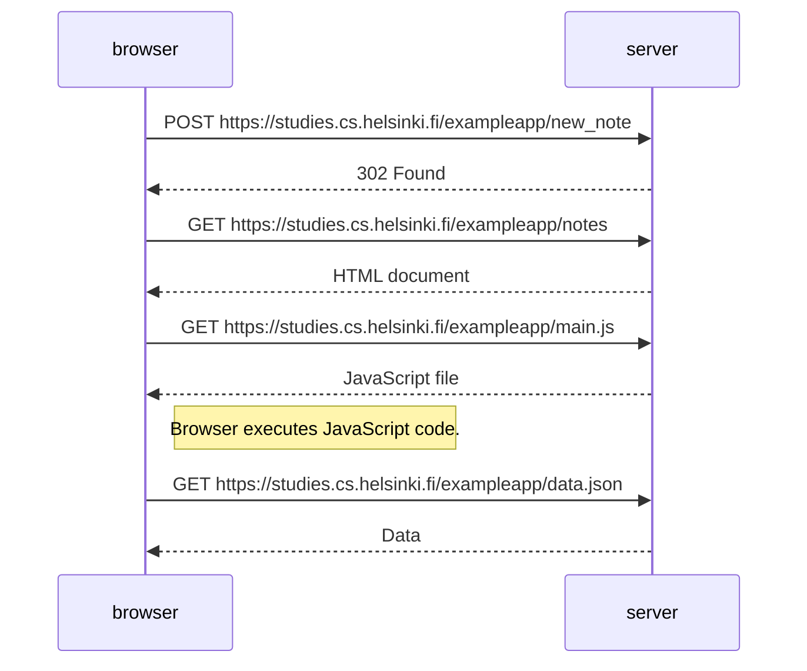

```mermaid
sequenceDiagram
    participant browser
    participant server
    browser->>server: POST https://studies.cs.helsinki.fi/exampleapp/new_note
    server-->>browser: 302 Found
    browser->>server: GET https://studies.cs.helsinki.fi/exampleapp/notes
    server-->>browser: HTML document 
    browser->>server: GET https://studies.cs.helsinki.fi/exampleapp/main.js
    server-->>browser: JavaScript file
    Note right of browser: Browser executes JavaScript code. 
    browser->>server: GET https://studies.cs.helsinki.fi/exampleapp/data.json
    server-->>browser: Data
```
